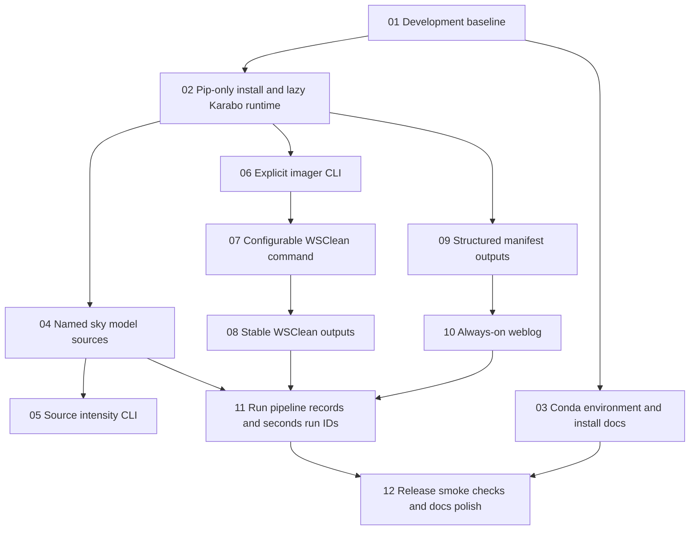

# Local Issue Index: skasim 0.2 Release Refinement

These issues are ordered by dependency. Each issue is a tracer-bullet slice with an end-to-end behavior and a suggested commit message for the implementation commit.

## Dependency Graph

## Issues

1. [Development baseline](./issues/01-development-baseline.md) — AFK — blocked by none
2. [Pip-only install and lazy Karabo runtime](./issues/02-pip-only-install-lazy-karabo.md) — AFK — blocked by 01
3. [Conda environment and install docs](./issues/03-conda-environment-install-docs.md) — AFK — blocked by 01
4. [Named sky model sources](./issues/04-named-sky-model-sources.md) — AFK — blocked by 02
5. [Source intensity CLI](./issues/05-source-intensity-cli.md) — AFK — blocked by 04
6. [Explicit imager CLI](./issues/06-explicit-imager-cli.md) — AFK — blocked by 02
7. [Configurable WSClean command](./issues/07-configurable-wsclean-command.md) — AFK — blocked by 06
8. [Stable WSClean outputs](./issues/08-stable-wsclean-outputs.md) — AFK — blocked by 07
9. [Structured manifest outputs](./issues/09-structured-manifest-outputs.md) — AFK — blocked by 02
10. [Always-on weblog](./issues/10-always-on-weblog.md) — AFK — blocked by 09
11. [Run pipeline records and seconds run IDs](./issues/11-run-pipeline-records.md) — AFK — blocked by 04, 08, 10
12. [Release smoke checks and docs polish](./issues/12-release-smoke-checks-docs.md) — AFK — blocked by 03, 11
