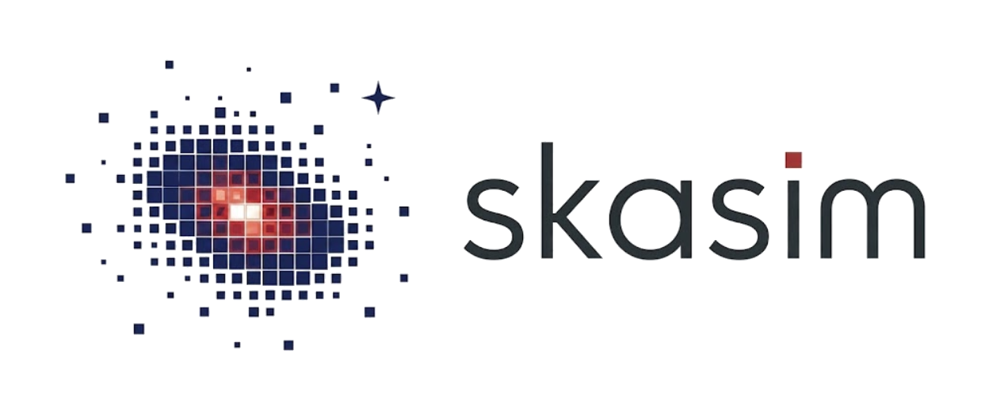

skasim
======

A simulation package for SKA-era radio interferometry.

.. toctree::
   :maxdepth: 2
   :caption: Contents:

   introduction
   installation
   guide
   outputs
   examples
   api

Indices and tables
==================

* :ref:`genindex`
* :ref:`modindex`
* :ref:`search`
